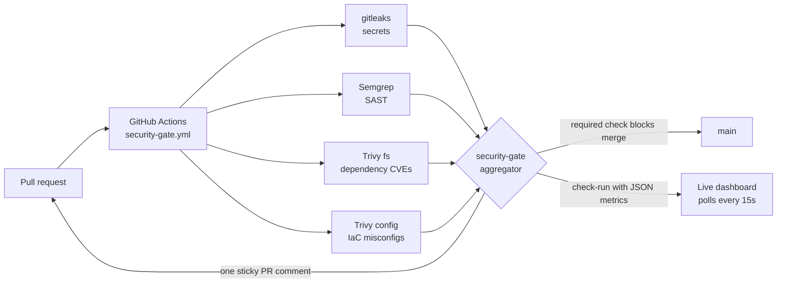

# proposal: PR security gate + live central dashboard

**Ask:** approve a 2-week pilot of an all-open-source, $0-license security gateway on every pull request, with one central live dashboard — instead of per-PR check spelunking.
**Status:** working end-to-end demo built today — live at [varun-infosec/sec-gate-demo](https://github.com/varun-infosec/sec-gate-demo) ([PR #1](https://github.com/varun-infosec/sec-gate-demo/pull/1)).

## The problem

- Bureau-Inc has **221 repos on GitHub Actions CI**, and our own posture doc lists SAST, SCA, secret scanning, and branch-protection standards as **TBD** (`.claude/ORG_PROFILE.md`).
- SOC 2 CC8.1 evidence shows the only required merge check on our sampled production repo is **`lint`** — security findings surface *after* merge (or in an audit), not before.
- Branch-protection consistency across the org is already an open ticket (**BCIS-3112**).

## What was built (demo, today)

One workflow per repo. Four parallel scanners, one verdict, one dashboard.

| Gate | Tool (all OSS, $0) | Blocks merge on |
|---|---|---|
| Secrets | gitleaks (CLI) | any detected secret |
| SAST | Semgrep `p/default` + our local rules | any blocking (ERROR) finding |
| Dependencies | Trivy `fs` | HIGH / CRITICAL CVE |
| IaC | Trivy `config` | HIGH / CRITICAL misconfig |
| — | aggregator | **any scanner error → fail closed** |

**Today's live demo run:** a realistic "feature PR" was stopped in **~45 seconds** with 1 planted secret, 7 blocking SAST findings, 4 HIGH/CRITICAL dependency CVEs, and 7 HIGH/CRITICAL Terraform misconfigs — merge button locked, developer got a single consolidated comment, and the dashboard updated on its own.

**Proof it's not a rigged demo:** on its *first ever run*, the gate failed our own "clean" baseline — it flagged the `curl | sh` installer pattern inside our own CI workflow and a fresh 2026 lodash advisory GitHub itself confirmed. We fixed both to go green. It catches real things, including ours.

## Why not per-PR check blocks? The dashboard

Reviewers and security shouldn't open N tabs across N PRs. The gate publishes machine-readable metrics into a GitHub **check-run**; a single self-contained dashboard (`dashboard/index.html`, zero external dependencies, no server, no vendor) polls the GitHub API every 15s and shows:

- **Live gate activity** — every repo/branch/PR, verdict, per-tool severity counts, in-flight runs pulsing
- **Org coverage map** — 202 inventoried repos as a wall: gated (green) vs ungated (gray), with the **owner rollup** (from our existing `repo_owners.csv`) telling us exactly who to onboard next
- Pass rate, open HIGH+CRIT, secrets caught pre-merge

## Cost

| | This proposal | GitHub Advanced Security equivalent |
|---|---|---|
| License | **$0** (all Apache/MIT-class OSS) | ~$30/committer/mo (Code Security) + ~$19/committer/mo (Secret Protection) |
| Infra | GitHub Actions minutes we already pay for; dashboard is a static file | included |
| Lock-in | none — SARIF/JSON artifacts kept per run | high |

At ~50 active committers, GHAS list price is ≈ **$29k/year**; this stack is $0 + maintenance time.

## Rollout plan

| Phase | When | What | Needs |
|---|---|---|---|
| 0 — Demo | today | throwaway public repo, end-to-end proof | done |
| 1 — Pilot | weeks 1–2 | reusable workflow in `Bureau-Inc/.github`; 5 volunteer repos call it in ~6 lines; **warn-only for week 1**, then block on HIGH/CRIT; org ruleset requires `security-gate` | **org-admin (DevOps)** — pairs with BCIS-3112 |
| 2 — Central metrics | weeks 3–4 | gate posts JSON to a collector (n8n webhook → SQLite on existing stack, or Cloudflare Worker + D1); evaluate DefectDojo for finding lifecycle/SLA | none new |
| 3 — Org-wide | month 2 | onboard by owner rollup; Slack alerts on main-branch failures via existing n8n; suppression file with security review; GitHub App token for dashboard | comms + CAB |

## Compliance value (evidence we currently lack)

| Framework | Control | What the gate evidences |
|---|---|---|
| SOC 2 | CC7.1 | continuous vulnerability detection in the SDLC |
| SOC 2 | CC8.1 | enforced security review in change management (per-PR, auditable) |
| ISO 27001 | A.8.25 / A.8.28 / A.8.29 | secure SDLC, secure coding, security testing in development |
| DPDPA / GDPR | reasonable security safeguards / Art. 32 | demonstrable pre-production controls on systems handling personal data |

Every run stores SARIF/JSON artifacts — audit evidence generated as a by-product.

## Risks & mitigations

- **False positives / developer friction** → week-1 warn-only mode; central suppression file requiring security sign-off; policy blocks only HIGH/CRIT.
- **Scanner/registry outage** → bundled local Semgrep rules, Trivy DB mirror failover, pinned versions; gate fails closed and says why.
- **Fork PRs** → default `GITHUB_TOKEN` is read-only on forks; gate still runs, comment step degrades gracefully.
- **Dashboard token** → fine-grained read-only PAT in localStorage today; GitHub App in Phase 2.

## The asks

1. Approve the 2-week pilot (5 repos, warn-only week 1).
2. DevOps: org-admin action to create `Bureau-Inc/.github` reusable workflow + org ruleset (ties into BCIS-3112).
3. Nominate the 5 pilot repos (suggest: top of the dashboard's owner rollup).
